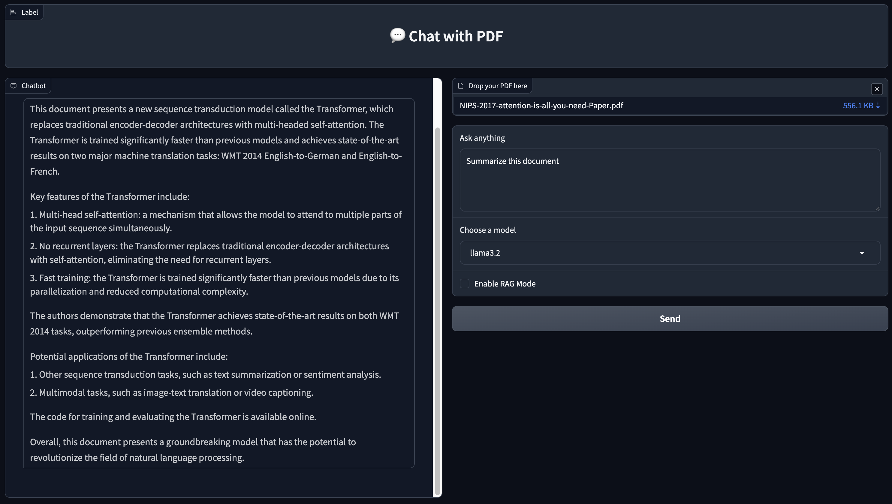

# 💬 Chat with PDF
It is a simple web app that lets you upload a PDF file and interact with it using natural language. Ask questions and get answers based on the content or summarize  your documents.

## 📸 Demo
  
> Upload a PDF and start asking questions or request something like "Summarize this document".

## 🚀 Features

- 🗂 Upload any PDF document.
- 🤖 Ask questions about the PDF using natural language.
- 🧠 Powered by Ollama, you can easily switch between locally installed LLMs.
- 🔍 RAG Mode to save your document in a local vector DB (ChromaDB) and answer questions using a RAG pipeline.
- 🖥️ Simple web interface using Gradio.

## 🎯 Goal
The main goal of this project is to provide a simple UI to experiment with different locally installed LLMs, implement a RAG pipeline, and test the limitations when enabling/disabling RAG while interacting with the LLM.


## 🧰 Tech Stack
- [Python](https://www.python.org/)
- [LangChain](https://www.langchain.com/)
- [Ollama](https://ollama.com/)
- [PyMuPDF](https://github.com/pymupdf/PyMuPDF)
- [Chroma DB](https://www.trychroma.com/)
- [Gradio](https://www.gradio.app/)

## ⚙️ Installation

### 1. Clone the repo
```bash
https://github.com/MohamedEmirHajji/chat-with-pdf
cd chat-with-pdf
```

### 2. Install the required python packages
```bash
pip install -r requirements.txt
```

### 3. Install Ollama
```bash
https://ollama.com/download
```

### 4. Pull your favorite LLM Models
The default list of models that will show up in the UI contains "llama3.2" and "deepseek-r1". This is an example of how to run "llama3.2" locally:
```bash
ollama run llama3.2
```

### 5. Run the project
```bash
 python chat_with_pdf.py 
```
After a few seconds, the local address will be printed in the console, by default you will see:
```bash
Running on local URL:  http://127.0.0.1:7861
```
